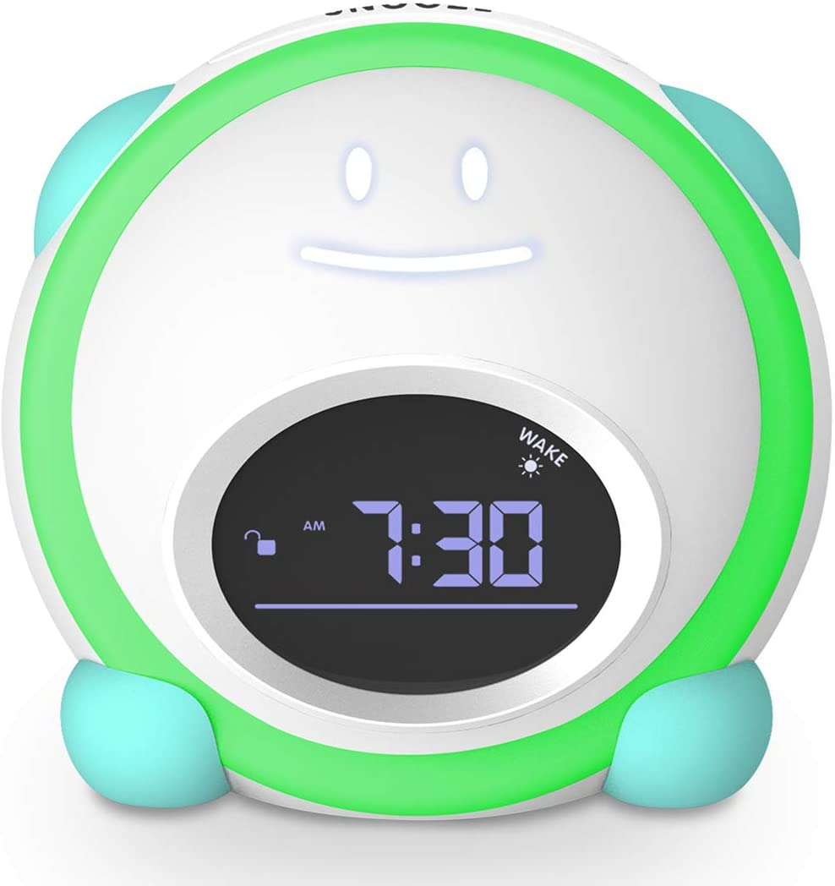

The last few months, I've been struggling to find time to do the things I want to do. Between being a husband and dad to a new baby and her older sister, having a full-time job, and doing some freelance work, I don't get a lot of time to myself. It was making me a bit depressed. My options were:

1. Wake up earlier.
2. Stay up later.
3. Resign myself to the fact that I will never have a quiet moment to myself again.

None of those sounded great. I chose option 4: add another hour to each day.

{height:300 width:300}

I bought my daughter a new alarm clock and got an hour back. Before, she would come wake me up around 5:45 am. Now she stays in her room until 7 am. I can wake up at 6, exercise, write, and sit down with silence for a minute. It's a miracle.

