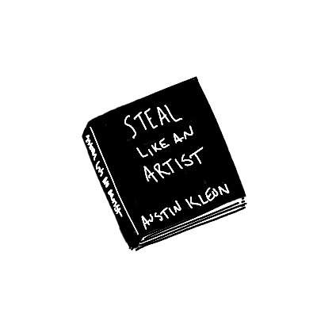

{width=200}

_Steal Like an Artist_ by Austin Klein was able to clearly articulate a lot of ideas that I have not been able to fully form myself. I have long believed that there really isn't any idea that has not been had before. Nothing is original. By stealing from one another[^1], we learn. If we steal many good things from a variety of people, we are able to combine them into something worthy of being stolen by someone else; We create our own voice.

The part I had not fully come to grips with is if nothing is original, what's the point? Klein included a quote from André Gide:

> Everything that needs to be said has already been said. **But, since no one was listening, everything must be said again.**

I love this perspective. As the father of a four year-old, this hit close to home. So, what's the point? There is someone who has not heard what you have to say. If they are going to hear it, why not let it be from you? I probably knew this already, but I couldn't articulate it before reading this book.

While I agree with most things in the book, I had a major disagreement with one point he makes. While talking about how we are able to learn by surrounding ourselves with people more talent, he said "if you ever find that you're the most talented person in the room, you need to find another room." While I get what he's getting at, it's too selfish of an attitude for me. A better question than which room can I move to, is how can help those in _this_ room become more talented. I think a lot can be gained from changing your perspective from "what can I take?" to "what can I give?"

I'll end with my favorite quote included in the book from Jessica Hische, a very talented designer:

> The work you do while you procrastinate is probably the work you should be doing for the rest of your life.

_Steal Like an Artist_ is a quick, worthwhile read. I give it a thumbs up. Thanks for reading, and as Klein recommends, I'm going to go and enjoy and use my obscurity.

[^1]: Obviously, never copy someone else's work and try to pass it off as yours.
